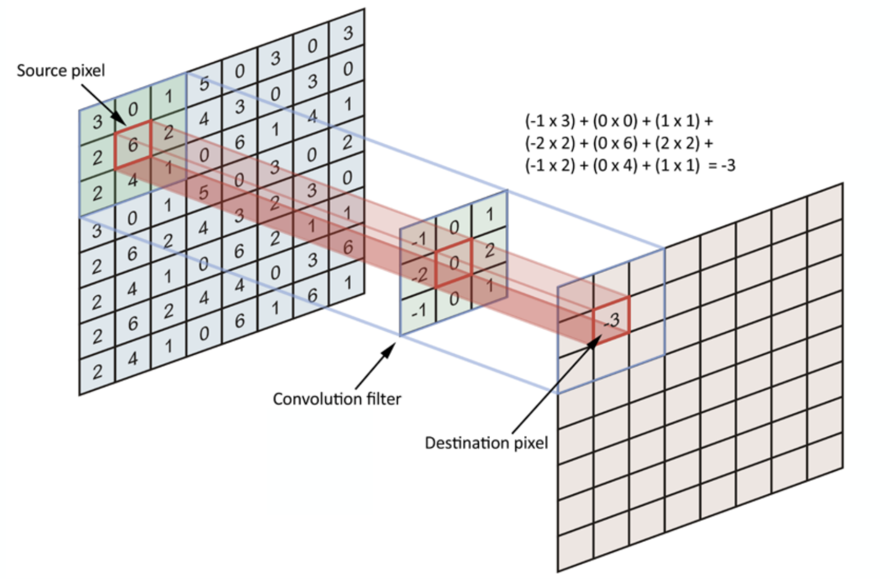

#Pattern Classification Using CNNs (Convolutional Neural Networks)

Convolutional Neural Networks (CNNs) are widely used in pattern classification. 
CNN is a multi layer perceptron (MLP) designed specifically to recognize small dimensional shapes with a higher degree 
of invariance to translation, scaling, skewing, and other forms of distortion [[1]](#1). Due to various limitations 
in traditional MLP networks, such as diffculties arise whilst training and overfitting at high dimensional space, different
reactions to an input and its shifted version as they are not translation invariant [[2]](#2), CNNs are ideal for
identifying features of data using filters (feature maps). 

###Convolutional Neural Networks
CNN is a multi layer perception that designed uniquely for pattern classification by extracting features in the data. 
The pairs of convolutional and subsampling layers are used for extract features First layers capture general features 
of the data and the last layers are able to capture more complex and specific data. 
The following figure depicts a convolutional operation that is the process of a convolutional filter (feature map) [[4]](#4). 

Each convolutional layer consists of numerous filters that could capture various features. 
Then, a subsampling layer is used to retrieve the highest weighted filters (as max pooling) to only forward highly 
important features to the next convolutional layer. Subsampling significantly helps to improve the performance of the 
network as it performs dimensional reduction. The final layer usually has a *softmax* non-linearity to obtain 
the probability values for the classification. Thus, CNN is basically a deep neural network which consists of hidden layers
having convolution and pooling functions in addition to the activation function for introducing non-linearity for 
pattern classification by extracting features.

###Dataset - CIFAR-10
We implement a deep CNN from scratch to classify 10 classes of images in the CIFAR-10 dataset [[3]](#3). 
The CIFAR-10 dataset consists of 60000 32x32 color images in 10 classes, with 6000 images per class.

We discuss the effect of diverse learning algorithms, loss functions, and weight initialization techniques. 
We further apply various optimization techniques to achieve the best classification accuracy.

###Learning Algorithms
Leaning algorithms update weights of the connected neurons in a machine learning network.
Various learning algorithms are utilized to train a CNN.
In this experiment, we use three learning algorithms to inspect the model performance for the given dataset.

* Stochastic Gradient Descent (SGD) with momentum term 
* Adaptive Gradient Algorithm (Adam)
    
   Adam is one of the extensively used optimization method in deep learning models with many successful stories in model fine-tuning.
    Adam maintains a per-parameter learning rate that improves performance on problems with sparse gradients [[5]](#5).
    
* Root Mean Square Propagation (RMSprop)
    
   Root Mean Square Propagation also maintains per-parameter learning rates that are adapted based on the average of 
   recent magnitudes of the gradients for the weight (e.g. how quickly it is changing). 
   This means the algorithm does well on online and non-stationary problems (e.g. noisy) [[5]](#5).

###Loss Functions
A loss function (or objective function) defines the target of the learning and implies the direction of the optimization for a model.
Since, this is a multi-class category problem the related two loss functions are inspected.

* Categorical crossentrophy
    
The categorical crossentropy is widlely used for mutli-class classification problems. It compares the distribution of 
the predictions (the activations in the output layer, one for each class) with the true distribution, 
where the probability of the true class is set to 1 and 0 for the other classes [[6]](#6). 
    
    
   To put it in a different way, the true class is represented as a one-hot encoded vector, and the closer the model’s outputs are to that vector, the lower the loss.
    
* Sparse categorical crossentropy 
    We can use sparse categorical crossentropy becuase the classes in the dataset are mutually exclusive.

#### References
<a id="1">[1]</a> S. Haykin, *Neural Networks and Learning Machines*. Pearson Education Inc, 3 ed., 2016.

<a id="1">[2]</a> "Simple introduction to convolutional neural networks." https://towardsdatascience.com/simple-introduction-to-convolutional-neural-networks-cdf8d3077bac. Accessed on 25-March-2020.

<a id="1">[3]</a> "The cifar-10 dataset." http://www.cs.toronto.edu/kriz/cifar.html. Accessed on 25-March-2020.

<a id="1">[4]</a> “Simple introduction to convolutional neural networks.”   https://towardsdatascience.com/simple-introduction-to-convolutional-neural-networks-cdf8d3077bac.  Accessed on 25-March-2020.

<a id="1">[5]</a> “Gentle introduction to the adam optimization algorithm for deep learning.”https://machinelearningmastery.com/adam-optimization-algorithm-for-deep-learning/.Accessedon 25-March-2020.

<a id="1">[6]</a> “Categorical crossentropy.”https://peltarion.com/knowledge-center/documentation/modeling-view/build-an-ai-model/loss-functions/categorical-crossentropy.  Accessed on 25-March-2020.

<a id="1">[7]</a> K. Simonyan and A. Zisserman, “Very deep convolutional for large-scale image recognition,” 2015.